# FoundryVTT Starfinder 2E Theme Module

This is a **FoundryVTT Starfinder 2E Theme Module** which transforms the default Pathfinder 2E-theme into a Starfinder 2E experience,  with updated colors, styles, and functionality fixes.

## Table of Contents

- [Installation](#installation)
- [Overview](#overview)
- [Features](#features)
- [Screenshots](#screenshots)
- [Support](#support)

## Installation

To install this module:

1. Open FoundryVTT and navigate to the **Add-on Modules** tab.
2. Click **Install Module**.
3. In the **Manifest URL** field, enter the URL to the module manifest: `https://github.com/LiftVortex/starfinder-playtest-theme/releases/latest/download/module.json`
4. Click **Install**.
5. Enable the module in the **Game Settings** > **Manage Modules** menu.

## Overview

The **FoundryVTT Starfinder 2E Theme Module** provides a complete visual overhaul of the default Pathfinder 2E theme, introducing a sleek and modern Starfinder 2E aesthetic. This module changes the color scheme and adjusts various UI elements to better fit the Starfinder universe.

## Features

### Theme Customization

- **Color Scheme**: The module replaces the Pathfinder 2E colors with Starfinder 2E colors.
- **UI Elements**: Customizes various UI elements such as buttons, inputs, and tooltips to match the Starfinder theme.

### Functionality Fixes

- **Character Sheet Buttons**: Fixes the issue with the ancestry, background, class, etc buttons, ensuring they correctly reference the appropriate starfinder 2e compendium data.

### Screenshots

Below are some example screenshots showcasing the new Starfinder 2E theme:

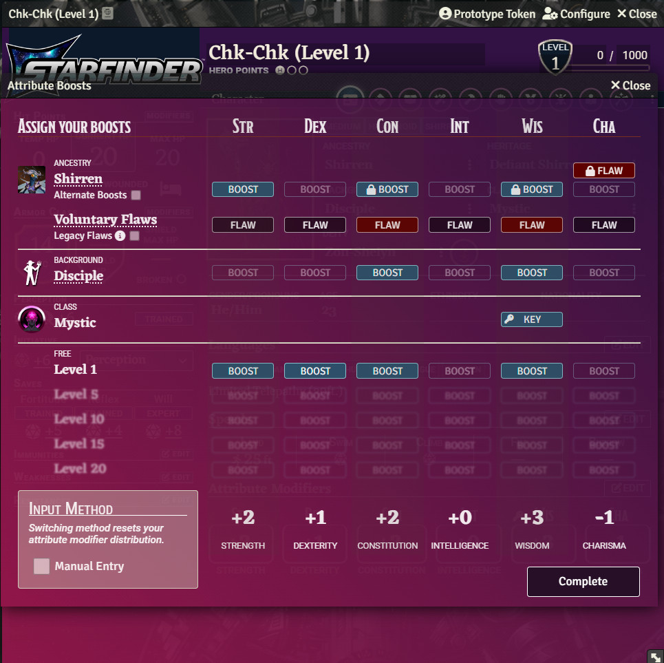
*Character Sheet - Attribute Selection*

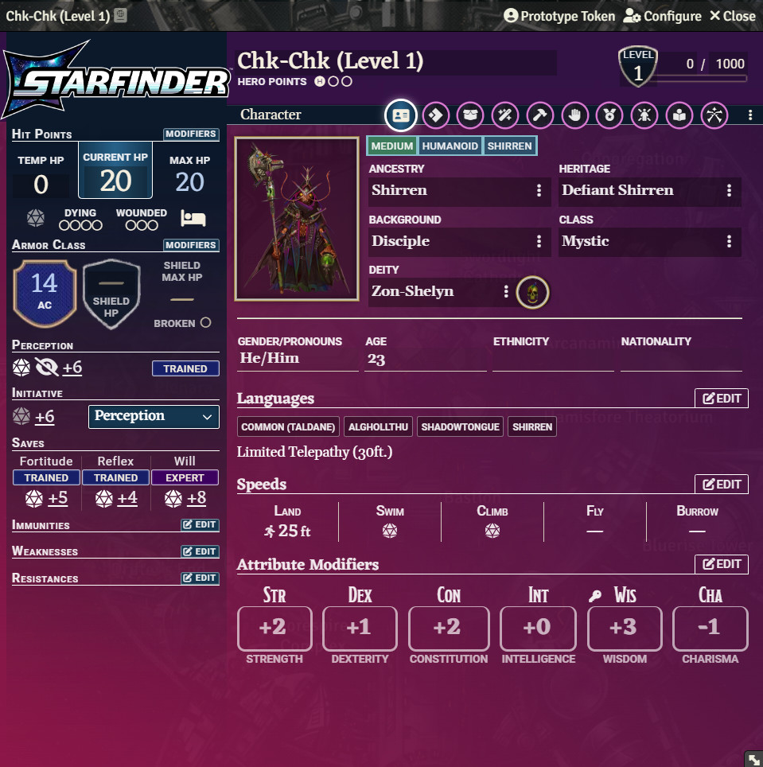
*Character Sheet - Character*

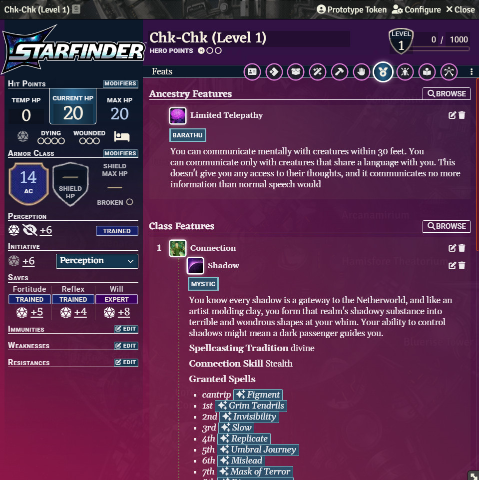
*Character Sheet - Feats*

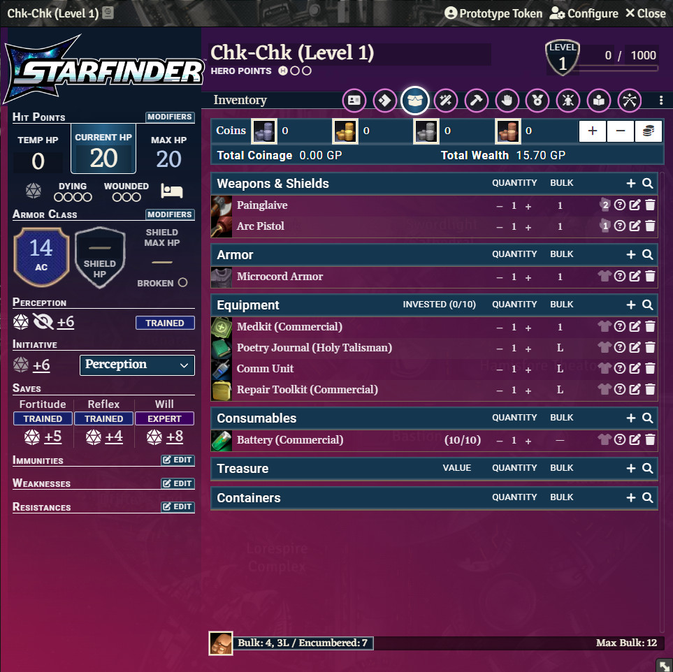
*Character Sheet - Inventory*

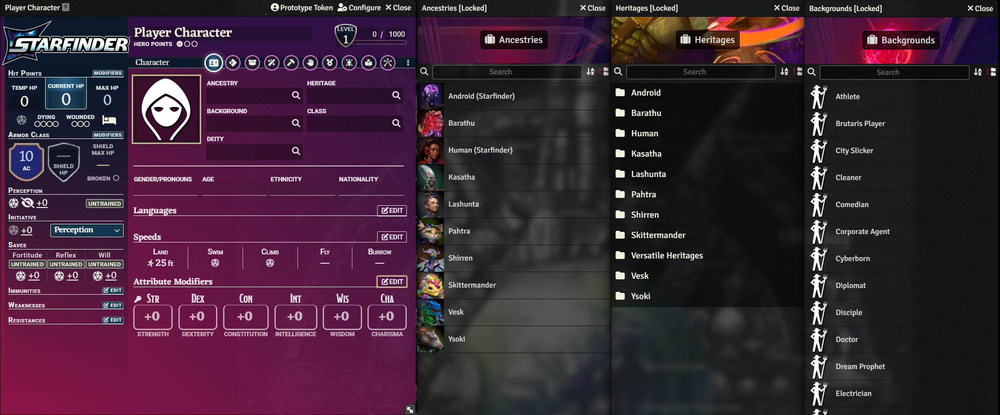
*Character Sheet - Links*

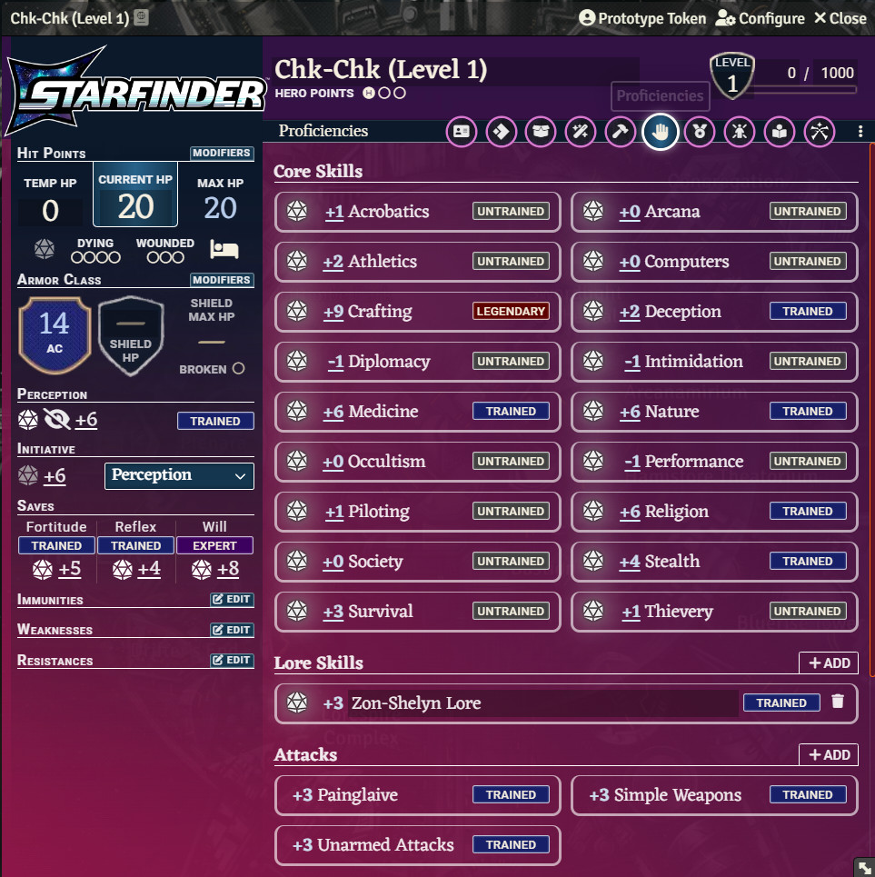
*Character Sheet - Proficiencies*

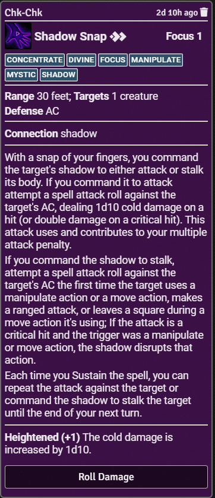
*Chat Message - Default*

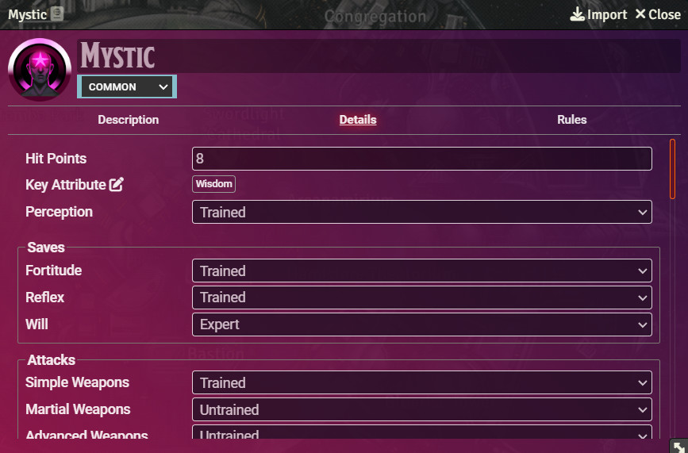
*Class*

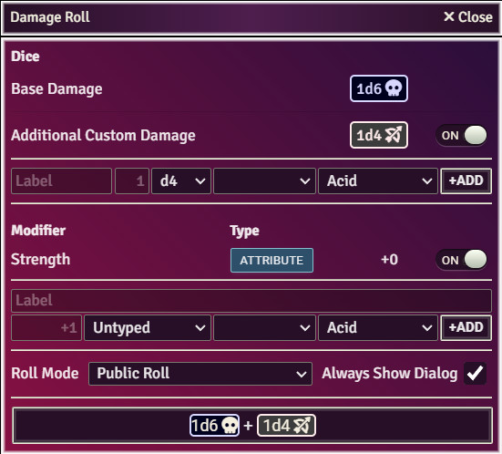
*Dice Damage Roller*

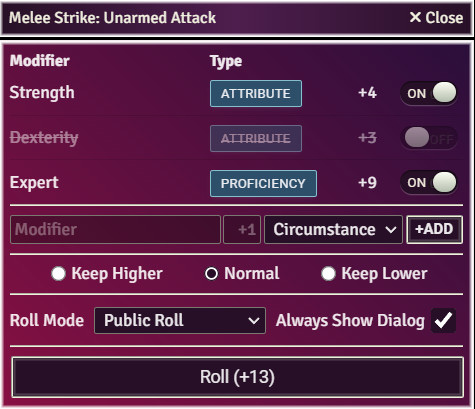
*Dice Roller*

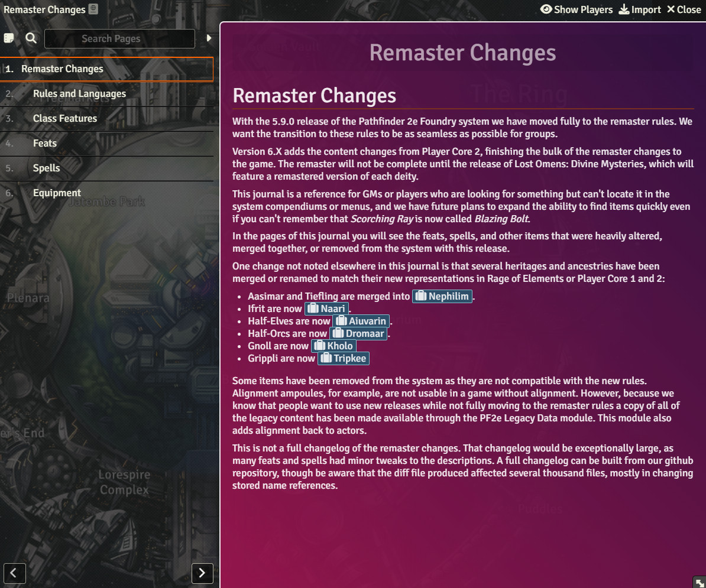
*Journal*

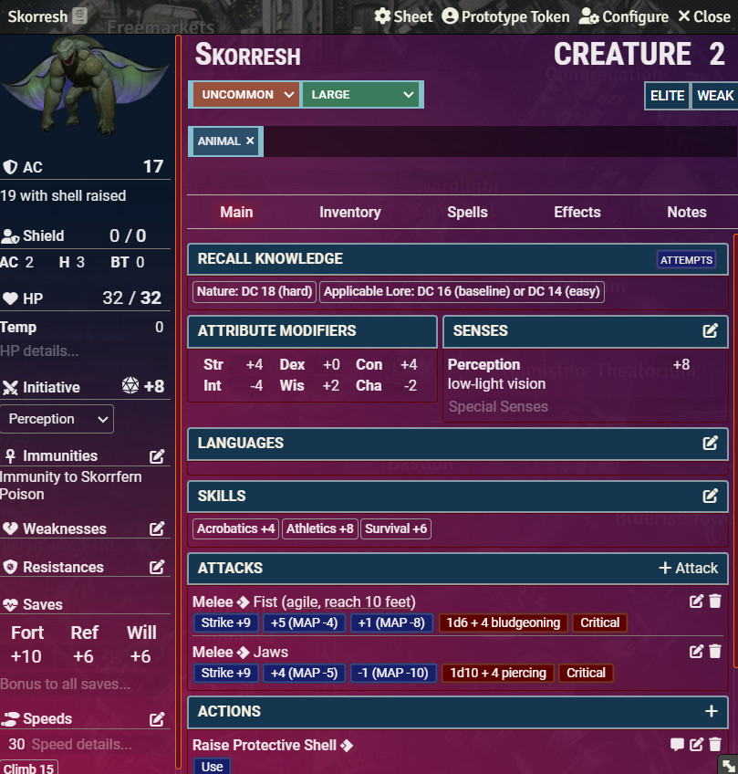
*NPC Sheet*

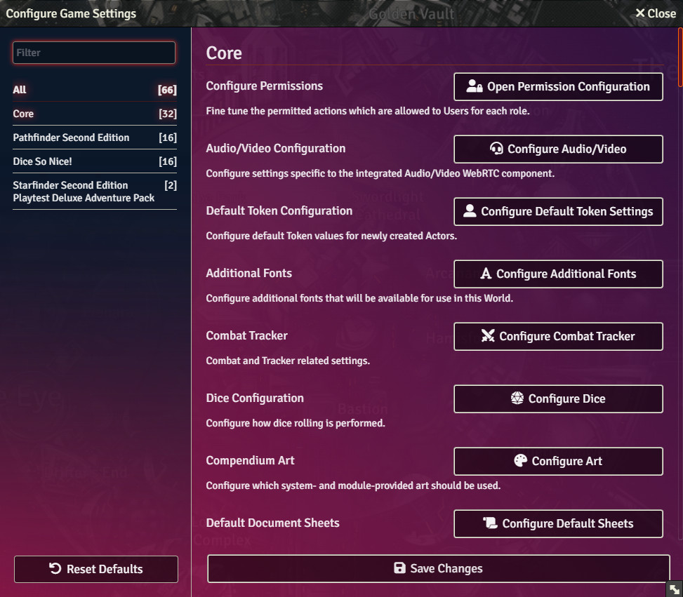
*Settings*

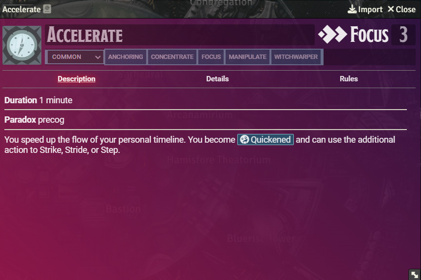
*Spell*

### Support

Please post any issues you are having to the issue tab on this github page.